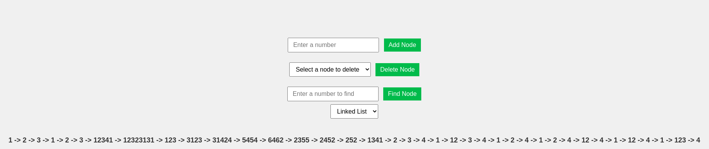

# Linked List Visualizer

A simple web application that allows users to interact with a linked list data structure. Users can add nodes, delete nodes, and find nodes.



## Features

- Add nodes with a given value
- Delete nodes by selecting them from a drop-down list
- Find nodes by value and display a success or failure message

## Usage

1. Install the required dependencies:

```bash
npm install
```

2. Run the application:

```bash
npm start
```

3. Open your browser and navigate to http://localhost:1234 to use the Linked List Visualizer.

## Technologies Used
  - TypeScript
  - Parcel.js
  - HTML
  - CSS